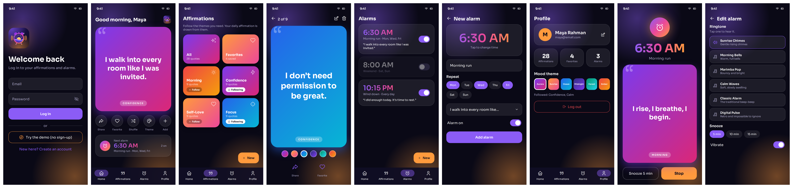

# Aura Alarm – Daily Affirmations & Smart Alarm

Flutter app  ⇄  Express REST API  ⇄  MongoDB, with Firebase Authentication (Email/Password).

```
┌────────────┐  Firebase Auth   ┌──────────────┐
│ Flutter app│ ───────────────▶ │   Firebase   │  (register / login / logout)
│            │ ◀─── ID token ── └──────────────┘
│            │
│            │  HTTPS + "Authorization: Bearer <Firebase ID token>"
│            │ ───────────────▶ ┌──────────────┐  verifyIdToken()  ┌──────────┐
└────────────┘                  │ Express API  │ ────────────────▶ │ Firebase │
                                │ /api/...     │                   │  Admin   │
                                └──────┬───────┘                   └──────────┘
                                       │ Mongoose (every query filtered by userId)
                                       ▼
                                ┌──────────────┐
                                │   MongoDB    │  users · affirmations · alarms
                                └──────────────┘
```

## No custom JWT
The app never creates, signs, or stores its own JWTs. Login happens in Firebase; the Flutter
client attaches Firebase's own ID token to each request, and the backend asks Firebase Admin to
verify it. The verified Firebase `uid` is saved as `userId` on every record, and every query
includes `{ userId: req.userId }`, so one user can never read or change another user's data.
(Firebase ID tokens are JWT-formatted internally; that is Firebase's mechanism, not an auth layer
built into this project.)



Screen previews are in `screenshots/` (design mockups of the screens the code builds).

## Look and feel
Dark, glowing "midnight aurora" style: frosted-glass cards over violet and sunrise-orange glows,
Sora typography, and big gradient quote cards, all drawn from the Aura Alarm logo colors.
- **99 hand-written affirmations** across 11 categories (Morning, Confidence, Self-Love, Gratitude,
  Focus, Courage, Calm, Health, Success, Sleep, General), added with one tap from the starter pack
- Category grid with Follow; the daily affirmation is drawn from the categories you follow
- Swipe up/down through quotes in a full-screen viewer: share, favorite, edit, delete
- Shuffle for a random affirmation on Home
- Six vivid mood themes (Aurora, Sunrise, Ocean, Midnight, Forest, Ember), saved per user
- Requires Flutter 3.22 or newer

## Demo mode (no sign-up)
The login screen has **Try the demo (no sign-up)**. It signs the visitor in with Firebase *Anonymous*
authentication, so they still get their own private sandbox (their own `userId`), pre-filled with
99 affirmations, followed categories and three sample alarms. Nothing is shared between visitors.
- Visitors can create a free account at any time; it is linked to the same account, so their data is kept.
- Enable it once: Firebase Console → Authentication → Sign-in method → **Anonymous → Enable**.
- Clean up old demo data: `cd backend && npm run cleanup-guests` (removes demo visitors older than 7 days).

## Smooth, Reels-style feel
- **Swipe feed:** tap the quote card on Home (or any quote in a list) to open a full-screen feed. Swipe up/down,
  cards shrink and fade as they leave, and the text fades up on each new quote. Double-tap to like (heart burst).
- **Transitions:** every screen change fades and settles; switching tabs cross-fades.
- **Touches:** light haptics on taps/likes/switches, buttons press in, lists and cards stagger in,
  shimmer skeletons replace spinners, and the background glow drifts slowly.
- Favorites, toggles and refreshes update in place without reloading the whole screen.
- Code lives in `flutter_app/lib/fx.dart`.

## Alarm ringing
Alarms really ring, like a normal alarm clock:
- **Ringtones:** six built-in tones (Sunrise Chimes, Morning Bells, Marimba Pop, Calm Waves, Classic Alarm,
  Digital Pulse). Tap one in the alarm form to hear it. Volume fades in gently and the tone loops until you stop it.
- **Ring screen:** shows the time, the label and the linked affirmation, with **Snooze** (5/10/15 min) and **Stop**.
- **Repeat days:** weekly alarms ring on the chosen days; one-time alarms switch themselves off after ringing.
- **Android/iOS:** rings with the app closed and the phone locked (setup: `android_setup/ANDROID_SETUP.md`, step 7).
  Repeating alarms are scheduled 14 days ahead every time you open the app.
- **Web:** browsers cannot wake a sleeping page, so alarms ring while the Aura Alarm tab is open.
- **Test:** Alarms tab > bell button rings a test alarm in 10 seconds.

## Logo and app icon
A new logo was designed for the app: an alarm clock with a sunrise inside and a violet-to-orange glow.
It is used in the app (splash, login, home) and as the app icon on Android (adaptive/round), iOS and the web favicon.
- Editable source: `flutter_app/assets/icon/logo.svg`
- After `flutter create`, run `dart run flutter_launcher_icons` (see `android_setup/ANDROID_SETUP.md`, step 6).

## 1. Firebase setup
1. Create a project at https://console.firebase.google.com.
2. **Authentication → Sign-in method → Email/Password → Enable.**
3. **Project settings → Service accounts → Generate new private key** → save as
   `backend/serviceAccountKey.json` (already git-ignored).
4. Register your Flutter app (Android and/or iOS) and connect it:
   ```bash
   dart pub global activate flutterfire_cli
   cd flutter_app && flutterfire configure
   ```
   Or manually add `android/app/google-services.json` / `ios/Runner/GoogleService-Info.plist`.

**Already configured for project `auraalarm-6ddf1`:** `lib/firebase_options.dart` has both the Android
and Web values, so the same code runs on phone and browser.
Android also needs the Gradle edits in `flutter_app/android_setup/ANDROID_SETUP.md`.
Put your service-account key at `backend/serviceAccountKey.json`; never put it in the Flutter app.

> **Deploying?** See `DEPLOY_RENDER.md` (Render + MongoDB Atlas).

## 2. Run the backend
```bash
cd backend
cp .env.example .env        # edit MONGODB_URI if needed (local or MongoDB Atlas)
npm install
npm run dev                 # http://localhost:5000
```
Check: `curl http://localhost:5000/api/health` → `{"status":"ok","db":"connected"}`

## 3. Run the Flutter app
This repo contains the Dart sources only, so generate the platform folders once:
```bash
cd flutter_app
flutter create . --project-name aura_alarm --org com.robiulhasan --platforms=android,ios,web
# the assets/ folder and pubspec.yaml in this repo are kept as-is
flutterfire configure        # or add google-services.json as above
flutter pub get
flutter run -d chrome        # web → API at http://localhost:5000/api
flutter run -d <android>     # Android emulator → API at http://10.0.2.2:5000/api
```
Other targets:
```bash
flutter run --dart-define=API_URL=http://localhost:5000/api         # iOS simulator
flutter run --dart-define=API_URL=http://192.168.1.20:5000/api      # real phone, same Wi-Fi
```
Android: make sure `android/app/build.gradle` has `minSdkVersion 23` or higher (Firebase needs it),
and that cleartext HTTP is allowed for local development
(`android:usesCleartextTraffic="true"` on `<application>` in `AndroidManifest.xml`).

## REST API
All routes need `Authorization: Bearer <Firebase ID token>` except `/api/health`.

| Method | Path | Purpose |
|---|---|---|
| POST | `/api/users/demo-seed` | Fill a demo visitor's sandbox with sample data |
| POST | `/api/users/sync` | Create/update the MongoDB profile after sign-in |
| GET / PUT | `/api/users/me` | Profile + stats / update name, followed categories, theme |
| GET | `/api/affirmations?category=&favorite=true` | List (filterable) |
| GET | `/api/affirmations/daily` | Today's affirmation (from followed categories) |
| GET | `/api/affirmations/categories` | Counts for the category grid |
| POST | `/api/affirmations/starter` | Add starter-pack affirmations |
| GET | `/api/affirmations/:id` | One affirmation |
| POST | `/api/affirmations` | Create |
| PUT | `/api/affirmations/:id` | Edit |
| PATCH | `/api/affirmations/:id/favorite` | Toggle favorite |
| DELETE | `/api/affirmations/:id` | Delete (unlinks alarms using it) |
| GET | `/api/alarms` | List (with linked affirmation text) |
| GET | `/api/alarms/:id` | One alarm |
| POST | `/api/alarms` | Create `{label,time:"HH:mm",repeatDays:[1-7],enabled,affirmationId}` |
| PUT | `/api/alarms/:id` | Edit |
| PATCH | `/api/alarms/:id/toggle` | Enable / disable |
| DELETE | `/api/alarms/:id` | Delete |

## Where each requirement lives
| Requirement | File |
|---|---|
| Screens & navigation | `flutter_app/lib/screens/*`, `home_shell.dart` (bottom nav), `main.dart` (AuthGate) |
| Firebase Authentication | `lib/services/auth_service.dart`, `backend/src/middleware/auth.js` |
| Flutter → REST | `lib/services/api_service.dart` |
| Express routes (CRUD) | `backend/src/routes/*` |
| MongoDB connection | `backend/src/config/db.js`, `backend/src/models/*` |
| Per-user data isolation | `userId` field in each model + filter in each route |

## Not included yet
The alarm is stored and managed (time, days, on/off, linked affirmation) but the app doesn't yet
ring on the device. To add that, schedule exact alarms from `ApiService.alarms()` with
`flutter_local_notifications` or the `alarm` package and show the linked affirmation in the notification.
