<div align="center">

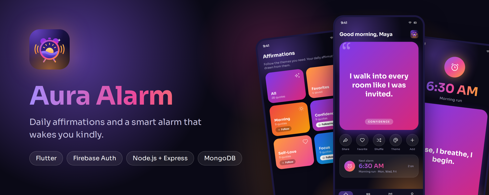

# Aura Alarm

**Daily affirmations and a smart alarm that wakes you kindly.**


</div>

---

## What is Aura Alarm?

Most alarms start your day with a harsh noise. Aura Alarm starts it with something kind.
Write or pick affirmations, link one to an alarm, and when the alarm rings you wake up to a
gentle ringtone and a card that tells you something good about the day ahead.

It is a full-stack app: a **Flutter** client, a **Node.js + Express** REST API, a **MongoDB** database,
and **Firebase Authentication** for sign-in.

## Screenshots

> These are design previews of the screens the app builds (names and numbers are sample data).

<table>
  <tr>
    <td align="center">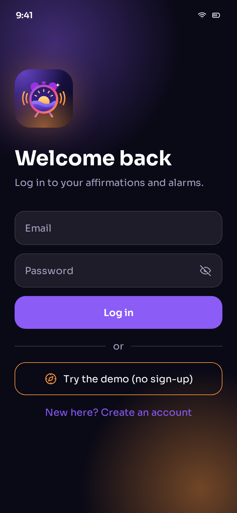<br><b>Login</b><br><sub>Email and password, or try the demo</sub></td>
    <td align="center">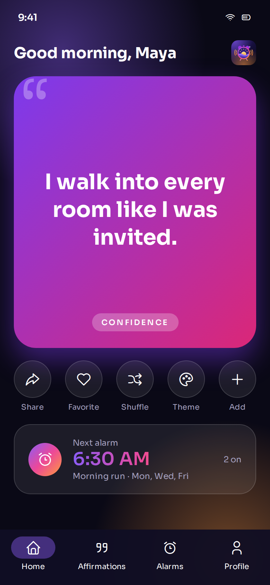<br><b>Home</b><br><sub>Today's affirmation, quick actions, next alarm</sub></td>
    <td align="center">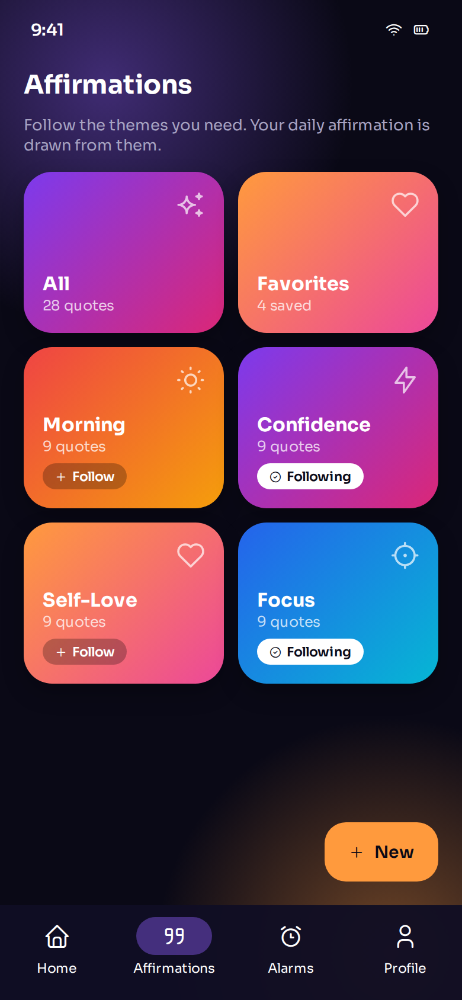<br><b>Categories</b><br><sub>Follow the themes you need</sub></td>
  </tr>
  <tr>
    <td align="center">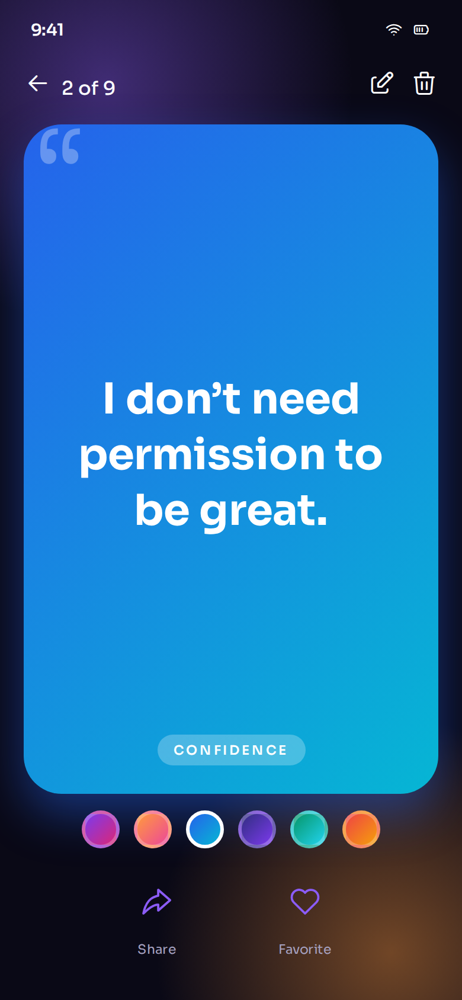<br><b>Swipe feed</b><br><sub>Reels-style quotes, double-tap to like</sub></td>
    <td align="center">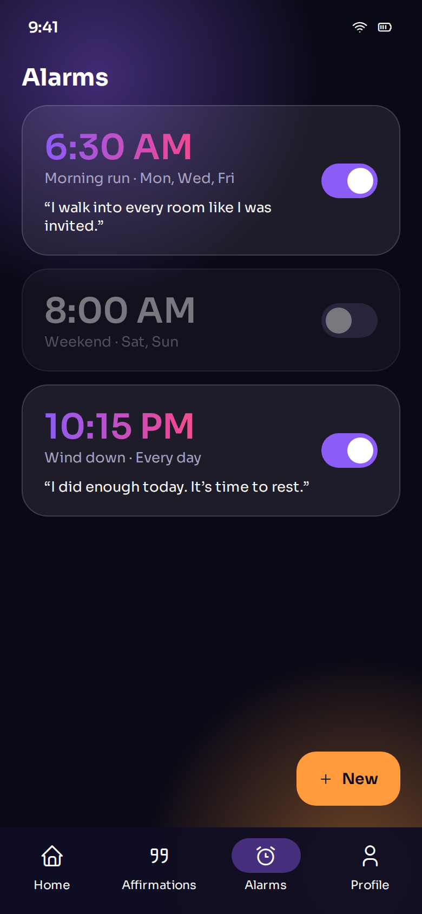<br><b>Alarms</b><br><sub>Toggle, edit and delete</sub></td>
    <td align="center">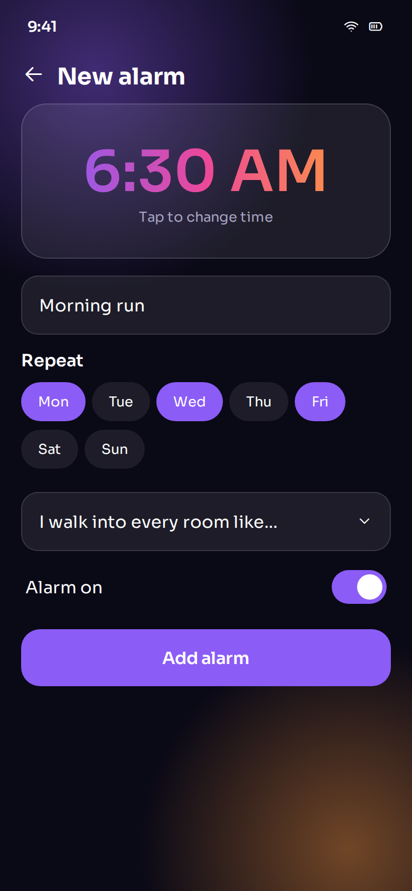<br><b>Add / edit alarm</b><br><sub>Time, repeat days, linked affirmation</sub></td>
  </tr>
  <tr>
    <td align="center">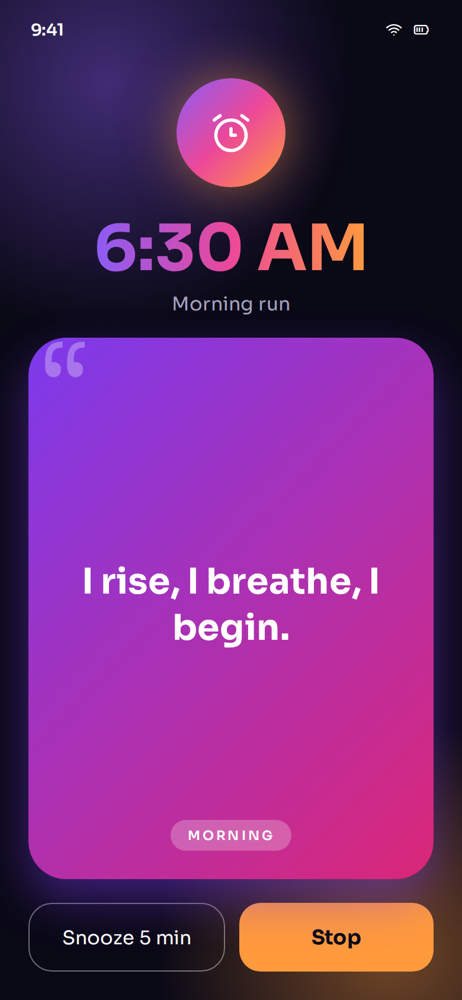<br><b>Ring screen</b><br><sub>Your affirmation, Snooze and Stop</sub></td>
    <td align="center">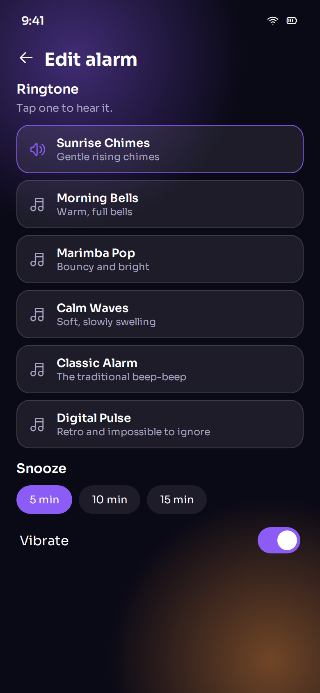<br><b>Ringtones</b><br><sub>Six tones, tap to preview</sub></td>
    <td align="center">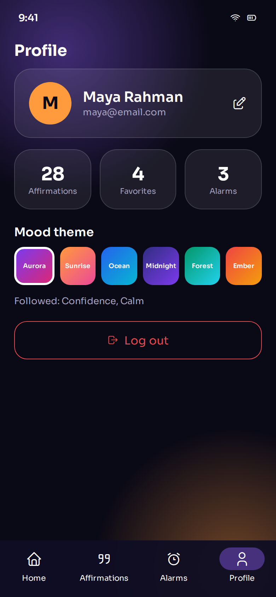<br><b>Profile</b><br><sub>Stats, mood theme, log out</sub></td>
  </tr>
</table>

## Features

**Alarms that really ring**
- Rings with the app closed and the phone locked (Android), with vibration and a gradual volume fade-in
- Six built-in ringtones: Sunrise Chimes, Morning Bells, Marimba Pop, Calm Waves, Classic Alarm, Digital Pulse
- Full-screen ring screen with your linked affirmation, **Snooze** (5, 10 or 15 minutes) and **Stop**
- Repeat days, enable/disable switch, and one-time alarms that switch themselves off after ringing
- "Test ring" button to hear and see an alarm in 10 seconds

**Affirmations**
- 99 hand-written affirmations in 11 categories, added with one tap from the starter pack
- Create, edit, delete, favorite, and filter by category or favorites
- Follow categories; the daily affirmation is drawn from the ones you follow
- Reels-style swipe feed with double-tap to like, share, and Shuffle for a random one
- Six mood themes (Aurora, Sunrise, Ocean, Midnight, Forest, Ember), saved to your account

**Accounts and privacy**
- Register, log in and log out with Firebase Authentication (email and password)
- **Try the demo** button: a private sandbox with sample data, no sign-up needed
- A demo visitor can upgrade to a real account and keep their data
- Every record is stored with the owner's `userId`; users can only ever see their own data

**Polish**
- Dark "midnight aurora" design with frosted-glass cards and a drifting glow
- Smooth page transitions, staggered list animations, shimmer loading, haptics
- Form validation, loading and error states, confirmation dialogs, empty states
- Responsive: phone-sized layout on phones and a centered column on wide web screens

## How it works

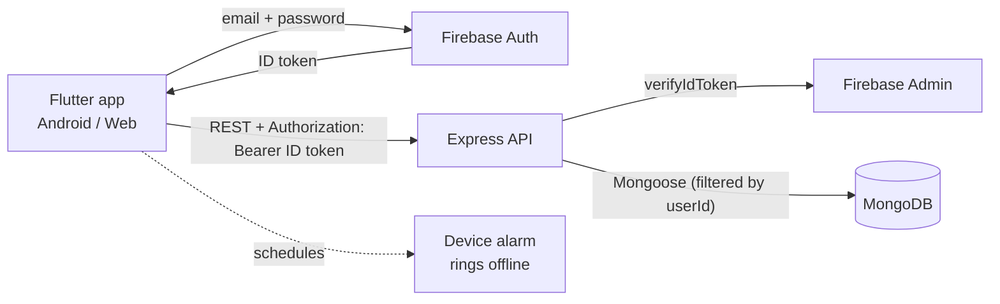

**No custom JWT.** Sign-in happens in Firebase. The app sends Firebase's own ID token with each request,
and the backend asks Firebase Admin to verify it. The verified Firebase `uid` becomes the `userId`
saved on every record and used in every query.

**Alarms are stored in MongoDB and scheduled on the phone.** Every time the app loads your alarms it syncs them
to real device alarms (the next 14 days for repeating alarms). That is why they still ring when the server
is asleep or the phone is offline. On web, browsers cannot wake a sleeping page, so alarms ring while the tab is open.

## Tech stack

| Layer | Technology |
|---|---|
| App | Flutter (Dart), Material 3, `google_fonts`, `share_plus` |
| Alarms | [`alarm`](https://pub.dev/packages/alarm), `audioplayers`, `permission_handler`, `shared_preferences` |
| Auth | Firebase Authentication (Email/Password and Anonymous for the demo) |
| API | Node.js 18+, Express, `helmet`, `express-rate-limit`, `cors` |
| Database | MongoDB with Mongoose |
| Hosting | Render (API) and MongoDB Atlas (database) |

## Quick start

### 1. Firebase
1. Create a project in the [Firebase Console](https://console.firebase.google.com).
2. **Authentication → Sign-in method:** enable **Email/Password** and **Anonymous** (the demo button needs it).
3. Register an **Android** app (`com.robiulhasan.aura_alarm`) and a **Web** app, and put their values in
   `flutter_app/lib/firebase_options.dart` (or run `flutterfire configure`).
4. **Project settings → Service accounts → Generate new private key** for the backend.
   Keep this file private and never commit it.

### 2. Backend
```bash
cd backend
cp .env.example .env          # then edit MONGODB_URI and the Firebase key path
npm install
npm run dev                   # http://localhost:5000
```
Check it: `curl http://localhost:5000/api/health` returns `{"status":"ok","db":"connected"}`.

| Variable | Purpose |
|---|---|
| `MONGODB_URI` | MongoDB connection string (local or Atlas) |
| `GOOGLE_APPLICATION_CREDENTIALS` | Path to the service-account JSON (local development) |
| `FIREBASE_SERVICE_ACCOUNT` | The service-account JSON or its base64 (use this on Render) |
| `CORS_ORIGIN` | Optional: allowed web origins, comma separated |
| `PORT` | Set automatically on Render |

### 3. Flutter app
```bash
cd flutter_app
flutter pub get
flutter run -d chrome                                   # web
flutter run -d <android-device>                         # Android
```
The API address is set in `lib/config.dart`. Override it without editing code:
```bash
flutter run --dart-define=API_URL=http://10.0.2.2:5000/api        # Android emulator -> local backend
flutter build apk --release --dart-define=API_URL=https://YOUR-SERVICE.onrender.com/api
```

### 4. First run on Android
Allow **Notifications** and **Alarms & reminders** when asked. On Xiaomi, Samsung, Oppo and Huawei phones also set
the app's battery to **Unrestricted**, or the phone may stop alarms. Then open the Alarms tab and tap the bell icon
to hear a test alarm in 10 seconds.

## Deploy

The backend is ready for Render with MongoDB Atlas. See **[DEPLOY_RENDER.md](DEPLOY_RENDER.md)** for the step-by-step
guide, or use the included `render.yaml` blueprint. The free plan sleeps when idle, so the first request after a
quiet period can take 30 to 60 seconds; the app waits for it and alarms are unaffected.

## REST API

All routes except `/api/health` need `Authorization: Bearer <Firebase ID token>`.

| Method | Path | Purpose |
|---|---|---|
| GET | `/api/health` | Health check (public) |
| POST | `/api/users/sync` | Create or update the profile after sign-in |
| POST | `/api/users/demo-seed` | Fill a demo visitor's sandbox with sample data |
| GET / PUT | `/api/users/me` | Profile and stats / update name, followed categories, theme |
| GET | `/api/affirmations` | List, with `?category=` and `?favorite=true` |
| GET | `/api/affirmations/daily` | Today's affirmation (from followed categories) |
| GET | `/api/affirmations/categories` | Counts for the category grid |
| POST | `/api/affirmations/starter` | Add the 99-affirmation starter pack |
| POST | `/api/affirmations` | Create |
| GET / PUT / DELETE | `/api/affirmations/:id` | Read / edit / delete |
| PATCH | `/api/affirmations/:id/favorite` | Toggle favorite |
| GET / POST | `/api/alarms` | List / create |
| GET / PUT / DELETE | `/api/alarms/:id` | Read / edit / delete |
| PATCH | `/api/alarms/:id/toggle` | Enable or disable |

## Project structure

```
Aura_alarm/
├── backend/                  Express API
│   └── src/
│       ├── config/           MongoDB + Firebase Admin setup
│       ├── middleware/       Firebase token check
│       ├── models/           User, Affirmation, Alarm
│       ├── routes/           users, affirmations, alarms
│       ├── data/             starter affirmations
│       └── scripts/          demo-visitor cleanup
├── flutter_app/
│   ├── lib/
│   │   ├── main.dart         entry point, auth gate
│   │   ├── config.dart       API address, categories
│   │   ├── theme.dart        colors, fonts, mood themes
│   │   ├── fx.dart           animations and haptics
│   │   ├── services/         api, auth, alarm scheduler, ringtone player
│   │   └── screens/          every screen
│   ├── assets/               logo, app icon, ringtones
│   └── android_setup/        Android notes
├── screenshots/              images used in this README
├── render.yaml               Render blueprint
└── DEPLOY_RENDER.md          deployment guide
```

## Troubleshooting

| Problem | Fix |
|---|---|
| `FirebaseOptions cannot be null` in Chrome | Add the Web app values to `lib/firebase_options.dart` |
| "This operation is restricted to administrators only" on the demo button | Enable **Anonymous** sign-in in Firebase Authentication |
| Release APK cannot reach the server | The `INTERNET` permission must be in `AndroidManifest.xml` (already included) |
| App still shows the Flutter icon or `aura_alarm` | Uninstall the old app, then `flutter clean` and rebuild |
| First request is slow or fails once | Render's free plan was asleep; wait a few seconds and retry |
| Alarm does not ring on one phone brand | Set battery to Unrestricted and allow "Alarms & reminders" |
| Backend says Firebase credentials not found | Set `FIREBASE_SERVICE_ACCOUNT` or `GOOGLE_APPLICATION_CREDENTIALS` |

## Security notes
- Never commit `.env` files or the Firebase service-account key (the `.gitignore` blocks them).
- If a key was ever shared or committed, delete it in the Firebase Console and generate a new one.
- Demo visitors are anonymous Firebase users; run `npm run cleanup-guests` in `backend/` now and then to remove old ones.

## Roadmap
- Alarms on iOS
- Gradual "sunrise" wake-up mode
- Custom ringtones from the phone
- Reminders and widgets for the daily affirmation
- Sharing affirmation cards as images
